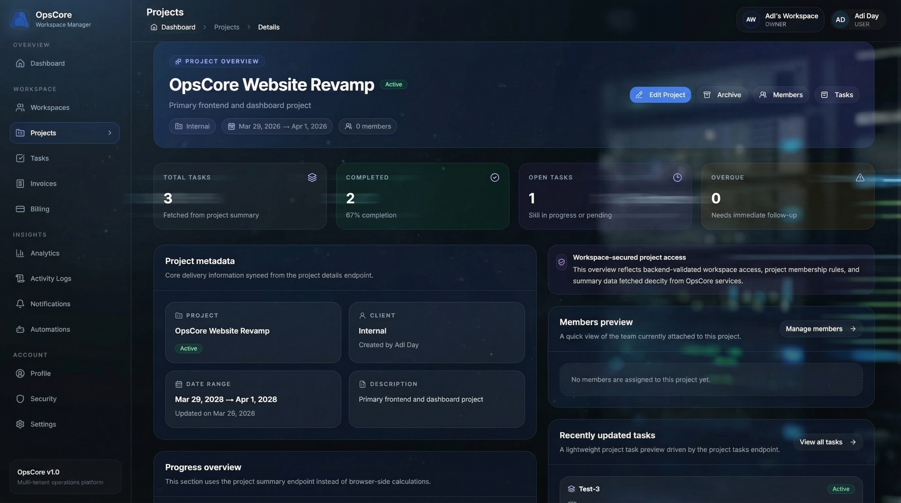
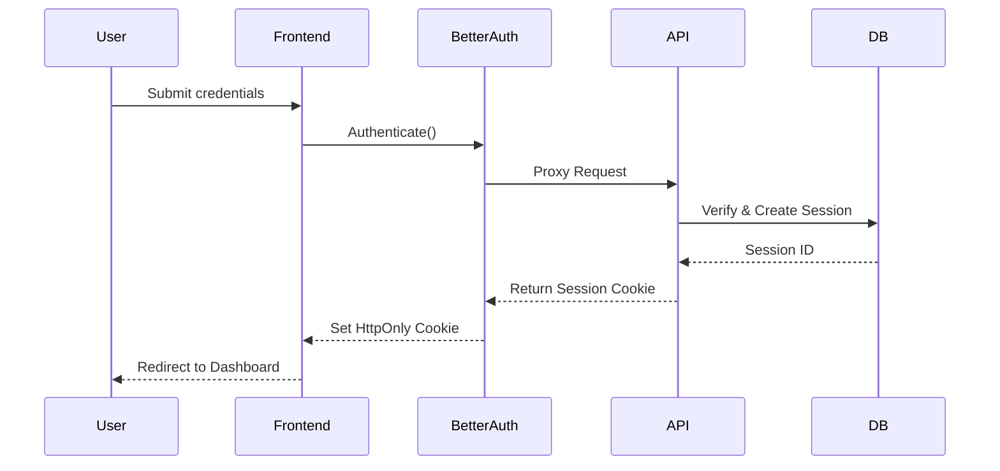
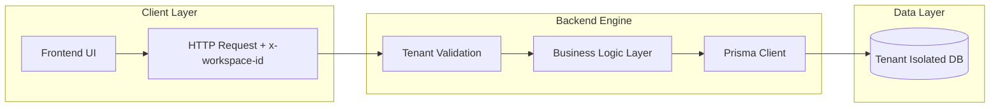
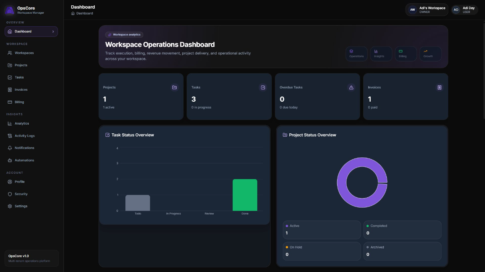
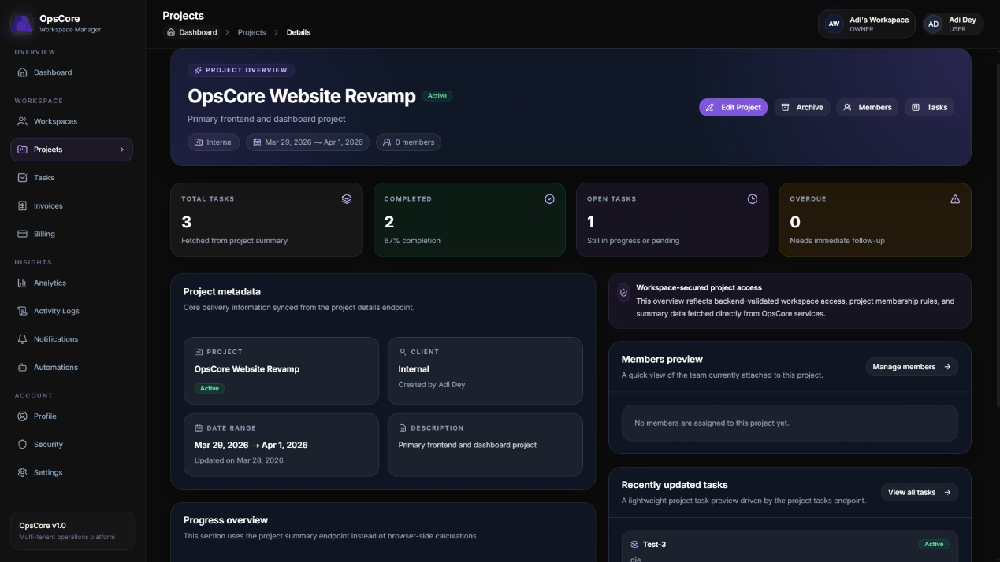
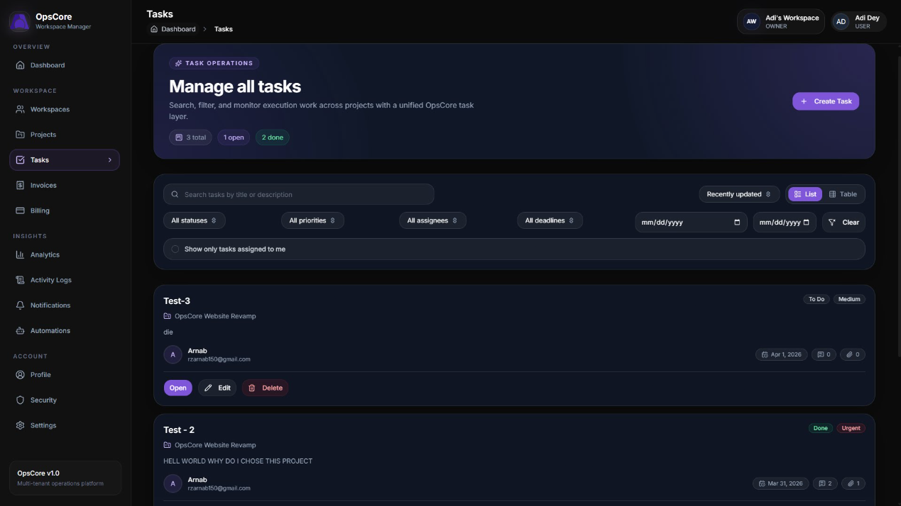

# OpsCore — Unified Operations Platform

### Seamless Multi-tenant SaaS Orchestration for Modern Enterprises

**A production-grade multi-tenant SaaS platform built to simulate real-world business operations at scale.**



[](https://nextjs.org/)
[](https://www.typescriptlang.org/)
[](https://better-auth.com/)
[](https://greensock.com/gsap/)
[](https://stripe.com/)
[](https://opscore-frontend.vercel.app)

---

### ✨ Key Highlights

- **Multi-tenant Architecture** with strict workspace data isolation.
- **Enterprise RBAC** (Owner, Admin, Member) with granular permissions.
- **Secure Session Management** powered by Better Auth & HTTP-only cookies.
- **Full Billing Lifecycle** integrated with Stripe and automated invoicing.
- **Business Intelligence** interactive dashboards for real-time analytics.

---

## 🚀 Why OpsCore?

OpsCore was engineered to bridge the gap between "simple dashboards" and **production-grade SaaS architecture**. It simulates the complex challenges faced by modern platforms:
- **Tenant Isolation**: Ensuring zero data leakage between organizations at the database level.
- **Scalable State**: Managing complex, cross-component business logic with TanStack Query.
- **Premium UX**: Implementing high-performance animations (GSAP) that remain fluid under load.

The goal was not just to build a UI, but to design a resilient, secure system capable of handling real-world business operations.

---

## 🌐 Live Demo

Explore the platform in a live production environment:

- **Frontend Application:** [https://opscore-frontend.vercel.app](https://opscore-frontend.vercel.app)
- **Backend API:** [https://opscore-backend.onrender.com](https://opscore-backend.onrender.com)

---

## 🧠 Architecture Highlights

- **Tenant Isolation**: Robust isolation strategy using the `x-workspace-id` header to scope all backend requests.
- **Role-Based Access Control (RBAC)**: Secure access patterns for `OWNER`, `ADMIN`, and `MEMBER` roles.
- **Soft-Delete System**: Critical production feature ensuring data recoverability across all core entities.
- **Prisma Relational Modeling**: Complex database schema design optimized for multi-tenant querying.
- **Service-Layer Architecture**: Decoupled backend design ensuring clean business logic separation from the API layer.

---

## 🔐 Technical Workflows

### Authentication Flow (Session-Based)

The system implements a secure authentication flow using **Better Auth**, leveraging encrypted session tokens stored in HTTP-only cookies for maximum security.



### Multi-tenant Data Flow (Isolation)

Data isolation is enforced via a specialized middleware layer that extracts the workspace context and applies it to every database operation.



---

## 💻 Tech Stack Reasoning

| Technology | Purpose | Strategic Reasoning |
| :--- | :--- | :--- |
| **Next.js 16** | Core Framework | Leverages App Router for optimized SSR and scalable frontend architecture. |
| **TypeScript** | Type Safety | Enforces strict contracts between internal modules, reducing production errors. |
| **Better Auth** | Authentication | Comprehensive, secure session-based auth with native multi-tenant support. |
| **TanStack Query** | Data Sync | Advanced caching and background synchronization for a "live" feel. |
| **GSAP** | Animations | Industry-standard for complex, high-performance micro-interactions. |
| **Prisma** | ORM | Type-safe database access with elegant relational modeling and migrations. |
| **Stripe** | Billing | Production-grade payment processing and automated subscription management. |

---

## 🔌 API Overview

OpsCore interacts with a centralized REST API tailored for multi-tenant operations. All requests are strictly validated against session integrity and tenant context.

### Auth Module
- `POST /api/v1/auth/register` — Create new organization and user accounts.
- `POST /api/v1/auth/login` — Authenticate and establish secure sessions.

**Example Request:** `POST /api/v1/auth/login`
```json
{
  "email": "arnab@opscore.dev",
  "password": "••••••••"
}
```

### Workspace Module
- `GET /api/v1/workspaces` — Retrieve all workspaces associated with the current user.
- `POST /api/v1/workspaces/create` — Initialize a new tenant with default branding.

### Billing & Invoices
- `POST /api/v1/billing/checkout` — Generate Stripe checkout sessions.
- `GET /api/v1/invoices` — List organization billing history and PDF links.

---

## 📸 Screenshots

### Dashboard Overview
Real-time insights into projects, tasks, and billing performance across the organization.



### Advanced Project Management
Collaborative workspace for tracking product lifecycles and team productivity.



### Billing & Subscription Suite
Integrated Stripe billing for managing subscriptions, methods, and invoices.



---

## 📂 Folder Structure

```bash
opscore-frontend/
├── src/
│   ├── app/           # Next.js App Router (Grouped by layout)
│   ├── components/    # Feature-driven UI components
│   ├── hooks/         # Custom business logic hooks
│   └── lib/           # Auth clients and fetcher utilities
opscore-backend/
├── prisma/            # Relational database schema & migrations
└── src/
    ├── app/ modules/  # Domain-specific services and controllers
    └── server.ts      # Server initialization & middleware
```

---

## 🛠 Installation & Local Setup

> [!IMPORTANT]
> This project uses a **decoupled architecture**. The frontend and backend are independent repositories and must be running simultaneously to function.

### 1. Prerequisites
- Node.js 18+ & PNPM
- PostgreSQL Database
- Stripe Account (for billing features)

### 2. Implementation
```bash
# Clone the repository
git clone https://github.com/ArnabSaga/opscore-frontend.git
cd opscore-frontend

# Install dependencies
pnpm install

# Configure environment
cp .env.example .env.local
```

### 3. Environment Configuration
Ensure your `.env.local` contains the following:
```env
NEXT_PUBLIC_API_BASE_URL=http://localhost:5000/api/v1
NEXT_PUBLIC_APP_URL=http://localhost:3000
BETTER_AUTH_URL=http://localhost:3000
```

### 4. Running the App
```bash
pnpm run dev
```
The application will be available at `http://localhost:3000`.

---

## 🔮 Future Roadmap

- [ ] **Advanced AI Insights**: Predictive analytics for project completion and revenue.
- [ ] **Real-time Notifications**: Webhook-integrated notification engine for team actions.
- [ ] **Granular Audit Logs**: Enhanced activity tracking for compliance and security.
- [ ] **Mobile Optimization**: Dedicated responsive views for on-the-go management.

---

## 👤 Author

**Arnab Dey**  
*Full Stack Engineer • System Designer • Performance Architect*

- **GitHub:** [@ArnabSaga](https://github.com/ArnabSaga)
- **LinkedIn:** [Arnab Dey](https://linkedin.com/in/arnabdey)

---

## 📄 License

This project is currently not licensed for public use.
